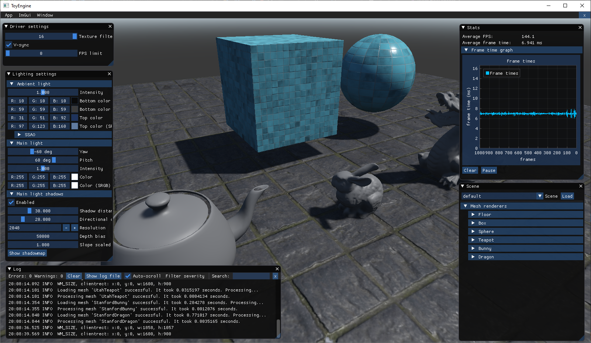
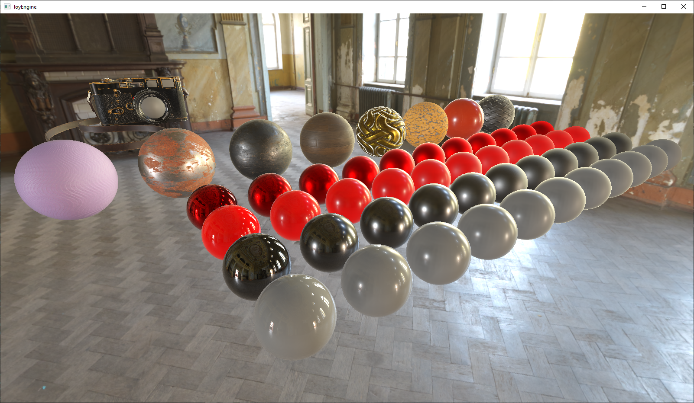
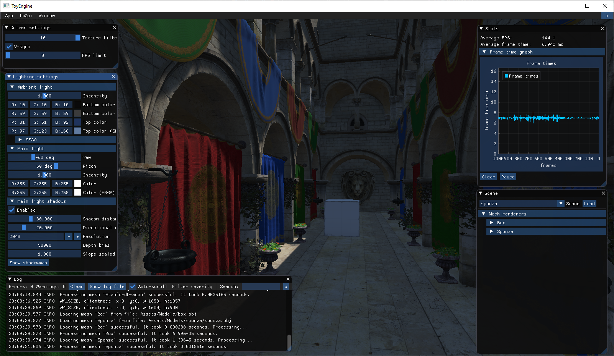
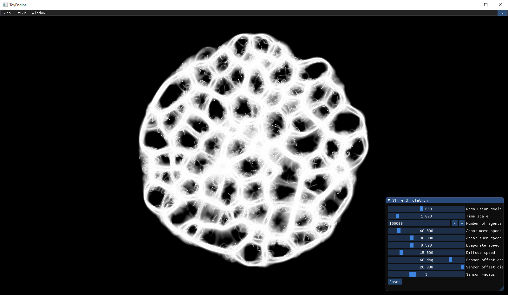

# ToyEngine
My attempt at a minimalistic graphics playground built from scratch with D3D11

## Features
- Graphics API abstraction
- Loading .obj models and .mtl material files
- Loading textures
- Profile markers
- Dear ImGui support for convenient debug tooling
- Minimalistic support for multi-compiling shader variants
- Minimalistic framework for 2D shadertoy-like experiments
  - Slime mold experiment based on [Sebastian Lague's "Coding Adventure: Ant and Slime Simulations"](https://youtu.be/X-iSQQgOd1A)
- Support for different scenes
- HDR + Tonemapping
- PBR direct lighting
- PBR indirect lighting
  - Image-based diffuse + specular
  - Based on sky or rendered environment map
- Soft shadows
  - 3 techniques
    1. Simple sampling tent
    2. Variance shadowmap
    3. Poisson disk sampling with variable penumbra
- Super simple procedural sky ...for now
  - Top color, horizon color and bottom color
- HBAO

## Screenshots

