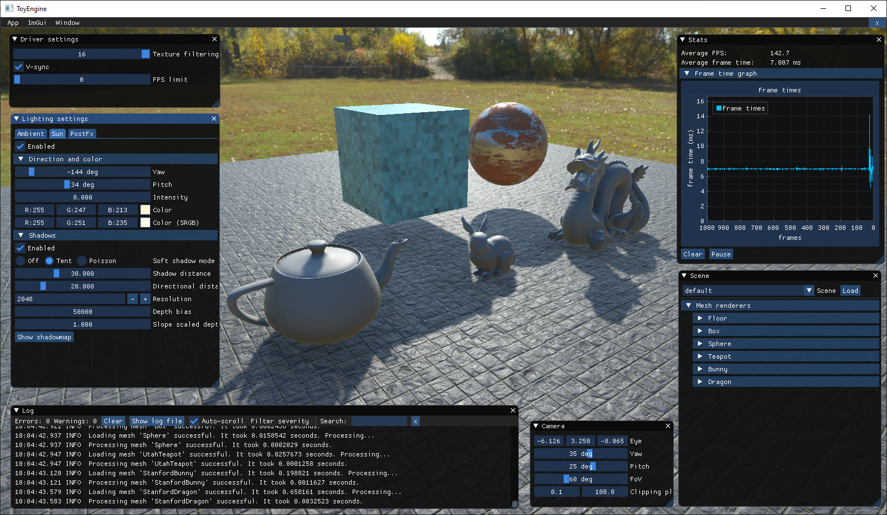

# ToyEngine
My attempt at a minimalistic D3D11 playground

## Features
- Graphics API abstraction
- Loading .obj models and .mtl material files
- Loading .png textures
- Dear ImGui support for convenient debug tooling
- Small scene with few objects
- Sponza scene
- PBR direct lighting
- Super simple ambient lighting (top color + bottom color) ...for now
- Super simple procedural sky (top color, horizon color and bottom color) ...for now
- HBAO

## Screenshots

